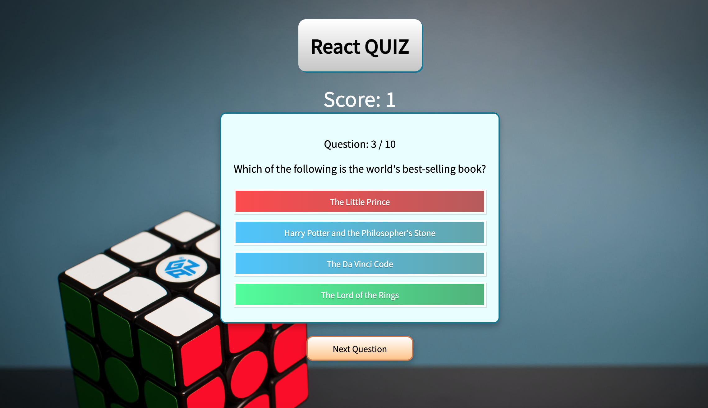

🎬 [튜토리얼 링크 : https://www.youtube.com/watch?v=F2JCjVSZlG0](https://www.youtube.com/watch?v=F2JCjVSZlG0)

퀴즈 API는 https://opentdb.com의 것을 사용합니다.

## 📋 새로 배운 점

- styled-component를 사용할 때, createGlobalStyle을 활용해 전역 스타일을 적용할 수 있다.
- 영상에서는 Enum 타입을 활용하는데, 열거형에 대해 잘 몰라 찾아보니 [라인 기술 블로그](https://engineering.linecorp.com/ko/blog/typescript-enum-tree-shaking/) 에서는 성능 이슈로 인해 열거형 대신 type을 활용할 것을 권장하는 것 같았습니다.
- styled-component와 타입스크립트를 함께 사용할 때, styled-component에 props를 넘겨줄 때는 속성값의 수에 따라 다른 방법으로 타입을 지정함을 알 수 있었습니다. [참고한 링크](https://velog.io/@hwang-eunji/styled-component-typescript#1-%EB%8B%A8%EC%9D%BC-props-%EC%82%AC%EC%9A%A9%EC%8B%9C)

### 🧭 향후 계획

- 간단한 미국 상식 퀴즈 앱을 만들어 보았는데, 자바스크립트 문법 관련 퀴즈 서비스를 만들어봐도 재밌을 것 같았습니다.
